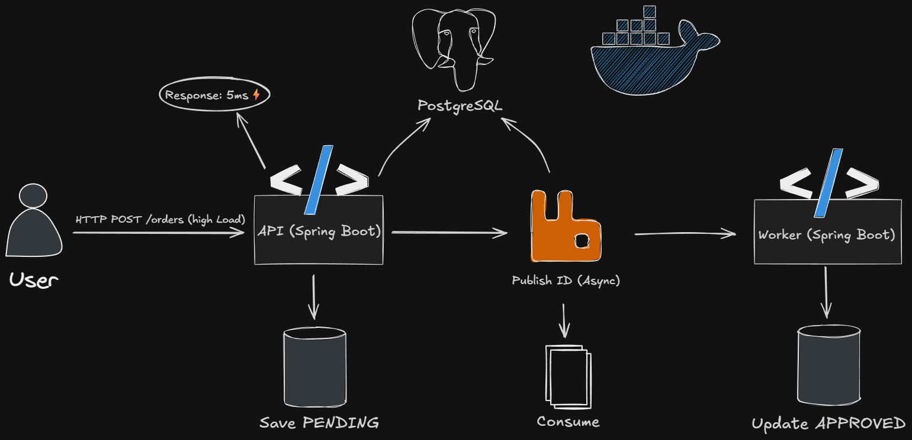

# 🚀 AsyncFlow Checkout API


> Um sistema de checkout de alta performance, resiliente e escalável, projetado com Arquitetura Orientada a Eventos para suportar picos de tráfego (Black Friday) sem bloquear o cliente.

---

## 🏗️ Arquitetura

O sistema resolve o problema de lentidão em checkouts tradicionais desacoplando o recebimento do pedido do seu processamento.



1.  **API (Producer):** Recebe o pedido, salva o estado inicial (`PENDING`) e publica o ID na fila. Tempo de resposta: **~5ms**.
2.  **RabbitMQ:** Atua como buffer (amortecedor), garantindo que nenhum pedido seja perdido mesmo sob alta carga.
3.  **Worker (Consumer):** Processa os pedidos em background de forma controlada, atualizando o status para `APPROVED`.

---

## ⚡ Performance (Load Test)

Testes de carga realizados com **K6** simulando 50 usuários simultâneos (Virtual Users).

| Métrica | Resultado |
| :--- | :--- |
| **Requisições Totais** | 915 (em 40s) |
| **Taxa de Erro** | 0.00% |
| **Latência Média (API)** | **5.04ms** 🚀 |
| **Processamento Assíncrono** | 100% enfileirado |

---

## 🛠️ Tecnologias

* **Core:** Java 21, Spring Boot 4
* **Database:** PostgreSQL 17
* **Message Broker:** RabbitMQ
* **Containerization:** Docker & Docker Compose
* **Testing:** K6 (Load Testing), JUnit 5

---

## 🚀 Como Rodar

### Pré-requisitos
* Docker & Docker Compose
* Java 21 (Opcional, se quiser rodar fora do Docker)

### Passo a Passo

1.  **Clone o repositório:**
    ```bash
    git clone [https://github.com/seu-usuario/asyncflow-checkout.git](https://github.com/seu-usuario/asyncflow-checkout.git)
    cd asyncflow-checkout
    ```

2.  **Suba a infraestrutura (RabbitMQ + Postgres):**
    ```bash
    docker compose up -d
    ```

3.  **Execute a aplicação:**
    ```bash
    ./mvnw spring-boot:run
    ```

4.  **Acesse a documentação ou teste:**
    * API rodando em: `http://localhost:8080`
    * RabbitMQ Management: `http://localhost:15672` (Login: guest/guest)

---

## 🔌 Endpoints

| Método | Rota | Descrição |
| :--- | :--- | :--- |
| `POST` | `/orders` | Cria um novo pedido (Assíncrono). Retorna `202 Accepted`. |
| `GET` | `/orders/{id}` | Consulta o status do pedido (`PENDING` -> `APPROVED`). |

**Exemplo de Payload (POST):**
```json
{
  "productCode": "NOTEBOOK-GAMER",
  "quantity": 1,
  "price": 3500.00
}
